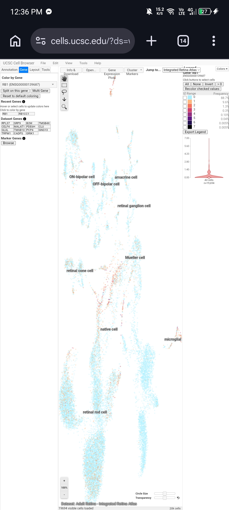
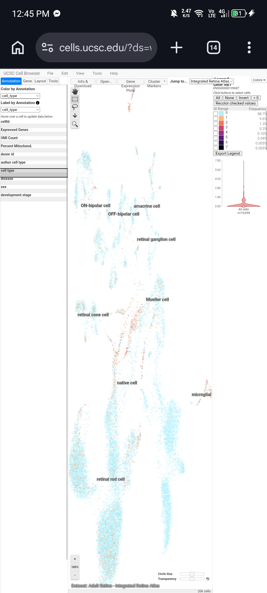
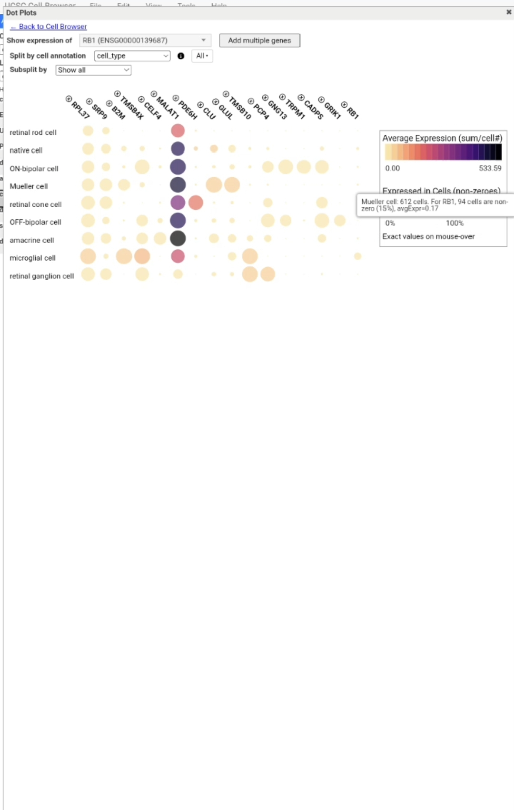
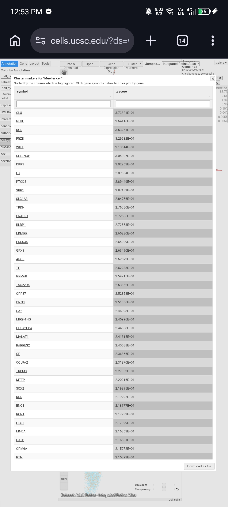

## UCSC Cell Browser Activity

**Assigned Gene:** RB1

**Associated Disease:** Retinoblastoma

---

### Organ/Tissue Choice and Dataset Information

- Dataset name: A single-cell transcriptome atlas of the adult human retina (Integrated Retina Atlas / wong-retina-atlas)
  
- Dataset URL: https://wong-retina-atlas.cells.ucsc.edu
  
- Publication: Lukowski et al., EMBO J. 2019
  
- Why relevant: Retinoblastoma arises from retinal cells, and RB1 loss-of-function is the direct genetic cause. This dataset profiles 20,009 cells from adult human retina and identifies all known neural retinal cell types (rod and cone photoreceptors, Müller glia, bipolar cells, amacrine cells, retinal ganglion cells, horizontal cells, astrocytes, microglia), letting me check where RB1 is normally expressed in the cell types relevant to this cancer.

**Screenshot 1:** 

---

### Understanding the Cell Map

a. Visualization type: UMAP

b. One dot represents: one individual retinal cell that was sequenced

c. Clusters represent: groups of cells with similar gene expression profiles, corresponding to distinct retinal cell types

d. Cell types visible: retinal rod cell (62.1%), native cell (18.8%), ON-bipolar cell (7.6%), Mueller cell (3.1%), retinal cone cell (3.0%), OFF-bipolar cell (2.9%), amacrine cell (1.4%), microglial cell (0.7%), retinal ganglion cell (0.3%)

---

### Assigned Gene Expression

a. Gene symbol: RB1

b. Dataset used: Integrated Retina Atlas (Adult Retina, wong-retina-atlas)

c. Expression pattern: Low and sparse overall — 88.7% of cells show no detectable expression (level 0), with only a small subset showing low-level expression

d. Cluster(s) with relatively stronger expression: Mueller cell, retinal cone cell

e. Cluster(s) with little/no expression: retinal rod cell (despite being the largest population in the dataset)

**Screenshot 2:** 

---

### Cell Types and Clusters

a. Strongest expression: Mueller cell

b. Another cluster with detectable expression: retinal cone cell

c. Low/undetected: retinal rod cell (the largest population, ~62% of all cells, but almost entirely showing no detectable RB1 signal)

d. Pattern: Overall low and sparse — not restricted to one tiny cluster, but not broadly high either. Detectable expression is scattered across several clusters (Mueller cells, cone cells, some bipolar/amacrine/ganglion cells) at low intensity, rather than concentrated in a single dominant cell type.

e. Possible biological explanation (interpretation only): RB1 is a cell-cycle checkpoint gene, and most retinal cell types in the adult retina are post-mitotic (no longer dividing), which could explain why expression is low overall. Müller glia are known to retain some proliferative/progenitor-like capacity in the retina, which may explain why they show relatively higher RB1 signal compared to fully differentiated, non-dividing cells like mature rod photoreceptors. This is an interpretation based on this dataset alone and would need further evidence to confirm.

**Screenshot 3:** 

---

### Expression Plot

a. Cluster(s) compared: Mueller cell vs. retinal rod cell (via dot plot comparing RB1 across all cell types)

b. Selected vs. comparison cells: Mueller cell shows higher RB1 expression — 15% of Mueller cells (94 of 612) express RB1 at an average level of 0.17, compared to only 8% of retinal rod cells (991 of 12,239) at an average level of 0.09. Mueller cells show roughly double the detection rate and expression level of rod cells, even though rod cells are by far the more numerous population in this dataset.

c. What the plot adds: The dot plot gives exact, quantifiable numbers (percentage of cells expressing the gene, and average expression level) for each cluster, rather than just a visual impression of color density on the UMAP. This makes it possible to directly compare clusters instead of estimating by eye.

**Screenshot 4:** 

---

### Marker Genes

a. Cluster examined: Mueller cell

b. Marker gene 1: CLU (Clusterin), z-score = 37.38

c. Marker gene 2: GLUL (Glutamine Synthetase), z-score = 36.41

d. Marker gene 3: RGR (Retinal G-protein coupled Receptor), z-score = 35.33

e. Does RB1 behave like a marker gene here? No. RB1 does not appear near the top of the ranked marker list for Mueller cells, even though it showed relatively higher expression (15% of cells, avgExpr=0.17) in this cluster compared to others. This illustrates that a gene can have somewhat elevated expression in a cell type without being a defining/marker gene for it — markers like CLU and GLUL are far more specific and strongly expressed identifiers of Mueller cells than RB1 is.

**Screenshot 5:** 

---

### Disease Gene vs. Marker Gene

a. Assigned disease gene: RB1

b. Marker gene: CLU

c. More cell-type-restricted: CLU — its expression is tightly concentrated in the Mueller cell cluster, with a much higher expression range (legend up to 435) forming a dense, solid block of high-expression cells specifically there.

d. More broadly expressed: RB1 — even though its overall expression is low (legend only reaches 7), the small amount of detectable expression is scattered thinly across many different clusters (Mueller, cone, bipolar, amacrine, ganglion cells) rather than concentrated in one place.

e. What this teaches: A marker gene like CLU is defined by being both highly expressed and tightly restricted to one cell type, making it useful for identifying that cell type. A disease-associated gene like RB1 can be biologically important across many cell types at low levels, without being uniquely tied to any single one — being a critical gene for cellular function (like a cell-cycle checkpoint) is a different role than being a cell-type marker.

---

### Connection to Genome Browser and ClinVar

1. Chromosome: 13 (13q14.2)

2. Disease-associated variant: NM_000321.3(RB1):c.103C>T (p.Gln35Ter) — pathogenic, creates a premature stop codon at residue 35

3. Cell type(s) expressing RB1 in this dataset: Detectable but low expression overall (88.7% of cells show none). Relatively higher detection appears in Mueller cells (15% of cells, avgExpr=0.17) and retinal cone cells, compared to retinal rod cells (8% of cells, avgExpr=0.09) despite rods being the largest population (62% of all cells).

4. Does this make biological sense? RB1 is a cell-cycle checkpoint gene, and most adult retinal cells are post-mitotic (no longer dividing), which likely explains the low expression seen across nearly all clusters. Müller glia are known to retain some proliferative or progenitor-like capacity in the retina, which may explain their relatively higher RB1 signal compared to fully differentiated, non-dividing cells like mature rod photoreceptors. Retinoblastoma itself arises from retinal progenitor cells during development, not from adult Müller glia directly — so this adult dataset shows a plausible but indirect connection: it reflects RB1's ongoing role in cells with some proliferative capacity, rather than the fetal/developing retinal progenitor population where retinoblastoma actually originates.

5. Does this dataset prove RB1 causes retinoblastoma? No. Expression data alone only shows RB1 is present/active in certain adult retinal cells; it cannot establish causation. That requires the functional evidence already gathered in the previous ClinVar activity — the c.103C>T nonsense variant, its "Pathogenic" classification, and multiple-submitter clinical evidence — combined with knowledge of RB1's biochemical role in cell-cycle control.

---

### Reflection

1. **What did the UCSC Cell Browser show you that the UCSC Genome Browser could not?**
   The Genome Browser showed where RB1 is located in the DNA and its exon/intron structure, but it couldn't tell me whether RB1 is actually being used by cells. The Cell Browser showed which retinal cell types express RB1 and how much, which is something location data alone can't reveal.

2. **Why can the same gene have different expression levels among different cell types?**
   Different cell types activate different sets of genes depending on their specific function. Mueller glia retain more proliferative-like activity than mature, fully differentiated rod photoreceptors, so a cell-cycle checkpoint gene like RB1 shows relatively higher activity there.

3. **Why should you be careful when interpreting a gene that shows zero or very low expression in single-cell data?**
   Single-cell sequencing has technical dropout, meaning a "zero" reading can reflect a true absence of expression or simply a transcript that wasn't captured during sequencing of that particular cell. Retinal rod cells showing only 8% detection doesn't necessarily mean RB1 is completely inactive in the rest of them.

4. **Why is it useful to combine information about genomic location, genetic variants, and cell-specific gene expression?**
   Each layer of data answers a different question — location shows what part of the gene structure is disrupted, the variant shows the functional/molecular consequence, and expression shows where and how much the gene normally matters biologically. Combining all three builds a much stronger picture than any single layer alone.

5. **What was the most interesting observation you made about your assigned gene?**
   The clearest observation was the contrast between RB1's low, scattered expression pattern and CLU's dense, tightly restricted pattern in the same cluster. It was also interesting that RB1, a gene tied to a childhood eye cancer, showed its clearest (though still modest) signal in Müller glial support cells rather than in photoreceptors.

---

### References and Links

- UCSC Cell Browser: https://cells.ucsc.edu/

- Dataset used: A single-cell transcriptome atlas of the adult human retina (Integrated Retina Atlas / wong-retina-atlas)

- DataRetinaL: https://wong-retina-atlas.cells.ucsc.edu

- Publication: Lukowski et al., EMBO J. 2019
